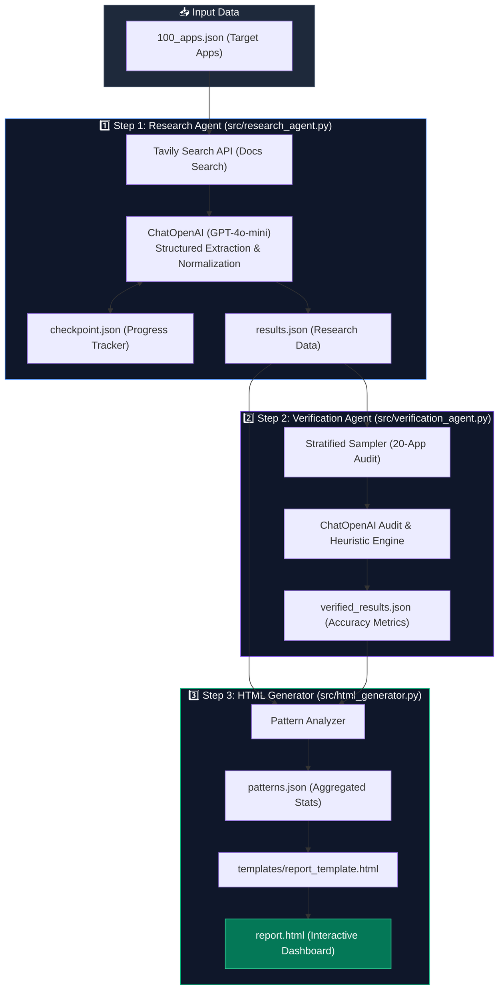

# Composio 100 App Research Agent

An autonomous AI-powered research and verification pipeline designed to systematically analyze 100 target web applications for **Composio toolkit buildability** and API ecosystem readiness.

### 💡 What This Project Does

- **🤖 Autonomous Technical Research**: Queries live developer documentation using Tavily Search & GPT-4o-mini to extract structured metadata (Auth types, API availability, self-serve access, MCP server support, buildability verdicts, and key technical blockers).
- **✅ Stratified QA Verification**: Conducts multi-pass verification audits across a 20-app stratified sample to ensure research precision and rule-based accuracy checks.
- **📊 Interactive Analytics Dashboard**: Aggregates macro patterns, category heatmaps, and toolkit expansion recommendations into a standalone, zero-dependency HTML dashboard (`report.html`).

---

## Project Structure

```
Project/
├── .env.example                # Template for environment configuration
├── .gitignore                  # Git ignore specification
├── README.md                   # Project setup & architectural documentation
├── report.html                 # Generated HTML Case Study Deliverable
├── requirements.txt            # Python dependency requirements
├── run.py                      # Pipeline Orchestrator & CLI Entrypoint
│
├── config/                     # Configuration & Settings
│   └── settings.py             # Paths, environmental settings & data models
│
├── data/                       # Datasets & Pipeline Outputs
│   ├── 100_apps.json           # Input dataset (100 target apps)
│   ├── results.json            # Research output dataset
│   ├── verified_results.json   # 20-app verification audit dataset
│   ├── patterns.json           # Statistical analysis dataset
│   └── checkpoint.json         # Progress checkpoint for resume capability
│
├── src/                        # Core Agent Source Code
│   ├── research_agent.py       # Research engine (Tavily + GPT-4o-mini)
│   ├── verification_agent.py   # Stratified QA verification engine
│   └── html_generator.py       # Pattern analyzer & HTML dashboard generator
│
└── templates/                  # Deliverable Templates
    └── report_template.html    # Interactive Dashboard HTML Template
```

---

## Quick Start

### 1. Environment Setup

Install project dependencies:

```bash
pip install -r requirements.txt
```

### 2. Configure API Keys

Create a `.env` file in the project root:

```env
OPENAI_API_KEY=your_openai_api_key
TAVILY_API_KEY=your_tavily_api_key
COMPOSIO_API_KEY=your_composio_api_key
MODEL_NAME=gpt-4o-mini
BATCH_SIZE=5
```

### 3. Run Pipeline

```bash
# Test run on sample apps
python run.py --test

# Run full pipeline (Research -> Verification -> HTML Generation)
python run.py

# Resume interrupted research from last checkpoint
python run.py --resume

# Regenerate HTML report deliverable only
python run.py --skip-research --skip-verify
```

---

## Architecture & Methodology



1. **Research Agent (`src/research_agent.py`)**:
   - Executes live web searches via `TavilySearchResults` for official developer documentation.
   - Leverages `ChatOpenAI` (GPT-4o-mini) to extract structured JSON schemas (Auth Methods, Access Model, API Type, API Coverage, MCP Server status, Buildability Verdict, Main Blockers, and Official Documentation URLs).
   - Applies strict evidence-based normalization (`normalize_auth_methods`, `normalize_self_serve`).

2. **Verification Agent (`src/verification_agent.py`)**:
   - Performs a 20-app stratified sampling audit (2 per product category).
   - Conducts independent deep research to verify field-by-field accuracy against fresh documentation.
   - Features automated heuristic cross-checks fallback if API limits are reached.

3. **Pattern Engine & HTML Generator (`src/html_generator.py`)**:
   - Aggregates statistical distributions across authentication protocols, access models, and API surfaces.
   - Compiles findings into `data/patterns.json`.
   - Renders `templates/report_template.html` into a single-file, zero-dependency interactive dashboard (`report.html`).

---

## Deliverable Features (`report.html`)

- **Interactive Dataset Table**: Displays records with initial 10-row pagination and "View More ↓" expansion.
- **Filtering & Search**: Real-time filtering by category, buildability verdict, self-serve access, MCP status, and search terms.
- **Verification Audit Matrix**: Field-by-field audit view displaying accuracy metrics (90%+ verified accuracy).
- **Interactive Visualizations**: Executive summary cards, category heatmaps, auth distribution charts, and easy-win toolkit recommendations.
